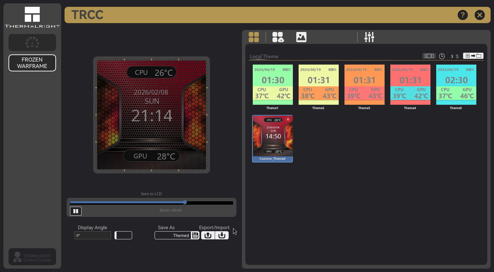

# TRCC Linux

[](https://github.com/Lexonight1/thermalright-trcc-linux/actions/workflows/tests.yml)
[](https://github.com/Lexonight1/thermalright-trcc-linux/actions/workflows/tests.yml)
[](https://github.com/Lexonight1/thermalright-trcc-linux/releases/tag/v1.2.0)
[](https://python.org)
[](LICENSE)
If this project helped you, consider [](https://buymeacoffee.com/Lexonight1)

Native Linux port of the Thermalright LCD Control Center (Windows TRCC 2.0.3). Control and customize the LCD displays on Thermalright CPU coolers, AIO pump heads, and fan hubs — entirely from Linux.

> Unofficial community project, not affiliated with Thermalright. I develop and test on Fedora — if something doesn't work on your distro, please [open an issue](https://github.com/Lexonight1/thermalright-trcc-linux/issues).

### Testers Wanted

I don't own every Thermalright device — if you have one that isn't fully supported yet, I need your help. Testing takes about 2 minutes: just run `lsusb` and `trcc detect --all`, then [open an issue](https://github.com/Lexonight1/thermalright-trcc-linux/issues/new) with the output. Devices I'm especially looking for:

- **Mjolnir VISION / VISION PRO** — LCD + LED, untested on Linux
- **GRAND VISION, Stream Vision, FROZEN WARFRAME Ultra** — newer Vision-series AIOs
- **Any HID LCD device** (`0416:5302`, `0418:5303`, `0418:5304`) — working but needs real-world confirmation



## Features

- **Themes** — Local, cloud, masks, carousel mode, export/import as `.tr` files
- **Media** — Video/GIF playback, video trimmer, image cropper, screen cast (X11 + Wayland)
- **Editor** — Overlay text/sensors/date/time, font picker, dynamic scaling, color picker
- **Hardware** — 77+ sensors, customizable dashboard, multi-device with per-device config, RGB LED control
- **Display** — 15 resolutions (240x240 to 1920x462), 0/90/180/270 rotation, 3 brightness levels
- **Extras** — 5 starter themes + 120 masks per resolution, on-demand download, system tray, auto-start

## Supported Devices

Run `lsusb` to find your USB ID (`xxxx:xxxx` after `ID`), then match it below.

**SCSI devices** — fully supported:
| USB ID | Devices |
|--------|---------|
| `87CD:70DB` | FROZEN HORIZON PRO, FROZEN MAGIC PRO, FROZEN VISION V2, CORE VISION, ELITE VISION, AK120, AX120, PA120 DIGITAL, Wonder Vision |
| `0416:5406` | LC1, LC2, LC3, LC5 (AIO pump heads) |
| `0402:3922` | FROZEN WARFRAME, FROZEN WARFRAME SE |

**HID LCD devices** — auto-detected, needs hardware testers:
| USB ID | Devices |
|--------|---------|
| `0416:5302` | AS120 VISION, BA120 VISION, FROZEN WARFRAME, FROZEN WARFRAME SE, FROZEN WARFRAME PRO, ELITE VISION, LC5 |
| `0418:5303` | TARAN ARMS |
| `0418:5304` | TARAN ARMS |

**HID LED devices** — RGB LED control:
| USB ID | Devices |
|--------|---------|
| `0416:8001` | AX120 DIGITAL, PA120 DIGITAL, Peerless Assassin 120 DIGITAL, HR10 2280 PRO DIGITAL, and others (model auto-detected via handshake) |

> HID devices are auto-detected. See the [HID Testing Guide](doc/HID_TESTING.md) if you have one — I need testers.

## Install

### Automatic (recommended)

```bash
git clone -b stable https://github.com/Lexonight1/thermalright-trcc-linux.git
cd thermalright-trcc-linux
sudo ./install.sh
```

Detects your distro, installs system packages, Python deps, udev rules, and desktop shortcut. On PEP 668 distros (Ubuntu 24.04+, Fedora 41+) it auto-falls back to a virtual environment if `pip` refuses direct install.

After it finishes: **unplug and replug the USB cable**, then run `trcc gui`.

### Manual one-liners

Find your distro, copy the block, paste in terminal. After it finishes: **unplug and replug the USB cable**, then **open a new terminal** and run `trcc gui`.

> **`trcc: command not found`?** Open a new terminal — pip installs to `~/.local/bin` which needs a new shell session to appear on PATH.

> See the **[Install Guide](doc/INSTALL_GUIDE.md)** for troubleshooting, optional deps, and 25+ distros step by step.

### Fedora / Nobara

```bash
sudo dnf install sg3_utils python3-pyqt6 ffmpeg && ([ -d thermalright-trcc-linux ] && git -C thermalright-trcc-linux pull || git clone -b stable https://github.com/Lexonight1/thermalright-trcc-linux.git) && cd thermalright-trcc-linux && pip install --break-system-packages -e . && trcc setup-udev && trcc install-desktop
```

### Ubuntu / Debian / Mint / Pop!_OS / Zorin / elementary OS

```bash
sudo apt install sg3-utils python3-pyqt6 ffmpeg python3-pip python3-venv && ([ -d thermalright-trcc-linux ] && git -C thermalright-trcc-linux pull || git clone -b stable https://github.com/Lexonight1/thermalright-trcc-linux.git) && cd thermalright-trcc-linux && pip install --break-system-packages -e . && trcc setup-udev && trcc install-desktop
```

### Arch / Manjaro / EndeavourOS / CachyOS / Garuda

```bash
sudo pacman -S sg3_utils python-pyqt6 ffmpeg python-pip && ([ -d thermalright-trcc-linux ] && git -C thermalright-trcc-linux pull || git clone -b stable https://github.com/Lexonight1/thermalright-trcc-linux.git) && cd thermalright-trcc-linux && pip install --break-system-packages -e . && trcc setup-udev && trcc install-desktop
```

### openSUSE

```bash
sudo zypper install sg3_utils python3-qt6 ffmpeg python3-pip && ([ -d thermalright-trcc-linux ] && git -C thermalright-trcc-linux pull || git clone -b stable https://github.com/Lexonight1/thermalright-trcc-linux.git) && cd thermalright-trcc-linux && pip install --break-system-packages -e . && trcc setup-udev && trcc install-desktop
```

### Void Linux

```bash
sudo xbps-install sg3_utils python3-PyQt6 ffmpeg python3-pip && ([ -d thermalright-trcc-linux ] && git -C thermalright-trcc-linux pull || git clone -b stable https://github.com/Lexonight1/thermalright-trcc-linux.git) && cd thermalright-trcc-linux && pip install --break-system-packages -e . && trcc setup-udev && trcc install-desktop
```

### Gentoo

```bash
sudo emerge --ask sg3_utils dev-python/PyQt6 media-video/ffmpeg dev-python/pip && ([ -d thermalright-trcc-linux ] && git -C thermalright-trcc-linux pull || git clone -b stable https://github.com/Lexonight1/thermalright-trcc-linux.git) && cd thermalright-trcc-linux && pip install --break-system-packages -e . && trcc setup-udev && trcc install-desktop
```

### Alpine

```bash
sudo apk add sg3_utils py3-pyqt6 ffmpeg py3-pip python3 && ([ -d thermalright-trcc-linux ] && git -C thermalright-trcc-linux pull || git clone -b stable https://github.com/Lexonight1/thermalright-trcc-linux.git) && cd thermalright-trcc-linux && pip install --break-system-packages -e . && trcc setup-udev && trcc install-desktop
```

### Bazzite / Fedora Atomic / Aurora / Bluefin

```bash
rpm-ostree install sg3_utils && echo "Reboot now, then run the next block" && systemctl reboot
```
After reboot:
```bash
([ -d thermalright-trcc-linux ] && git -C thermalright-trcc-linux pull || git clone -b stable https://github.com/Lexonight1/thermalright-trcc-linux.git) && cd thermalright-trcc-linux && python3 -m venv ~/trcc-env && source ~/trcc-env/bin/activate && pip install -e . && trcc setup-udev && trcc install-desktop
```
Launch: `source ~/trcc-env/bin/activate && trcc gui`

### SteamOS (Steam Deck)

Switch to Desktop Mode, open Konsole:
```bash
sudo steamos-readonly disable && sudo pacman -S --needed sg3_utils python-pip python-pyqt6 ffmpeg && ([ -d thermalright-trcc-linux ] && git -C thermalright-trcc-linux pull || git clone -b stable https://github.com/Lexonight1/thermalright-trcc-linux.git) && cd thermalright-trcc-linux && pip install --break-system-packages -e . && trcc setup-udev && trcc install-desktop && sudo steamos-readonly enable
```

### NixOS

Add to `/etc/nixos/configuration.nix`, then `sudo nixos-rebuild switch`:
```nix
environment.systemPackages = with pkgs; [
  python3 python3Packages.pip python3Packages.pyqt6 python3Packages.pillow
  python3Packages.psutil sg3_utils ffmpeg p7zip
];
services.udev.extraRules = ''
  SUBSYSTEM=="scsi_generic", ATTRS{idVendor}=="87cd", ATTRS{idProduct}=="70db", MODE="0660"
  SUBSYSTEM=="scsi_generic", ATTRS{idVendor}=="0416", ATTRS{idProduct}=="5406", MODE="0660"
  SUBSYSTEM=="scsi_generic", ATTRS{idVendor}=="0402", ATTRS{idProduct}=="3922", MODE="0660"
'';
```
Then:
```bash
([ -d thermalright-trcc-linux ] && git -C thermalright-trcc-linux pull || git clone -b stable https://github.com/Lexonight1/thermalright-trcc-linux.git) && cd thermalright-trcc-linux && pip install --break-system-packages -e . && trcc install-desktop
```

## Usage

```bash
trcc gui                  # Launch GUI
trcc detect               # Show connected devices
trcc send image.png       # Send image to LCD
trcc setup-udev           # Install udev rules
trcc install-desktop      # Install app menu entry and icon
```

See the **[CLI Reference](doc/CLI_REFERENCE.md)** for all 14 commands, options, and troubleshooting.

## Documentation

| Document | Description |
|----------|-------------|
| [Install Guide](doc/INSTALL_GUIDE.md) | Installation for all major distros |
| [CLI Reference](doc/CLI_REFERENCE.md) | All commands, options, and troubleshooting |
| [Changelog](doc/CHANGELOG.md) | Version history |
| [Architecture](doc/ARCHITECTURE.md) | Project layout and design |
| [Technical Reference](doc/TECHNICAL_REFERENCE.md) | SCSI protocol and file formats |
| [USBLCD Protocol](doc/USBLCD_PROTOCOL.md) | SCSI protocol reverse-engineered from USBLCD.exe |
| [USBLCDNEW Protocol](doc/USBLCDNEW_PROTOCOL.md) | USB bulk protocol reverse-engineered from USBLCDNEW.exe |
| [USBLED Protocol](doc/USBLED_PROTOCOL.md) | HID LED protocol reverse-engineered from FormLED.cs |
| [HID Testing Guide](doc/HID_TESTING.md) | HID device support (testers wanted) |
| [Supported Devices](doc/SUPPORTED_DEVICES.md) | Full device list with USB IDs |

## Contributors

A big thanks to everyone who has contributed to this project:

- **[Lcstyle](https://github.com/Lcstyle)** — HR10 2280 PRO Digital support (7-segment display, color wheel, NVMe temperature daemon)
- **[PantherX12max](https://github.com/PantherX12max)** — Trofeo Vision LCD hardware testing
- **[shadowepaxeor-glitch](https://github.com/shadowepaxeor-glitch)** — AX120 Digital hardware testing & USB descriptor dumps
- **[Xentrino](https://github.com/Xentrino)** — Peerless Assassin 120 Digital ARGB White hardware testing

## License

GPL-3.0
